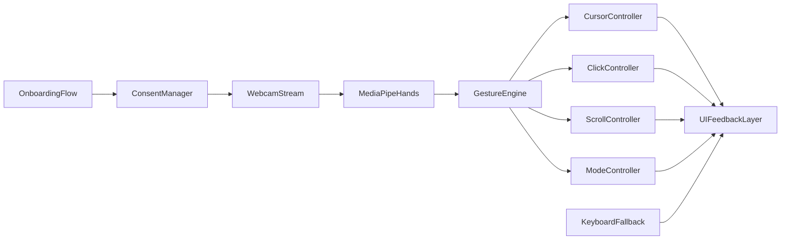

# Plano de MVP: Interface Web sem Toque

## Objetivo
Entregar uma página única de demonstração com controle por mão via webcam (MediaPipe), experiência segura de consentimento e fallback completo por teclado.

## Prioridade de Features

### Extremamente necessárias (MVP)
- Controle de cursor por movimento da mão (smooth + limites de tela).
- Clique por gesto de pinça (com debounce para evitar cliques duplicados).
- Scroll por posição vertical da mão (zona neutra + ganho configurável).
- Banner de consentimento de câmera com opção de revogar/parar captura.
- Onboarding guiado em 3 etapas: consentimento -> detecção -> teste de clique.
- Feedback de status em tempo real (câmera ativa, mão detectada, pinça detectada, fallback ativo).
- Fallback sem câmera por teclado (`setas`/`WASD` para mover foco/cursor virtual, `Enter`/`Espaço` para clique).
- Página de hospedagem em `index.html` com preview funcional da ferramenta.

### Importantes, mas não bloqueantes para MVP
- Painel de calibração ao vivo com presets (`Suave`, `Padrão`, `Rápido`).
- Histórico rápido de eventos em tempo real (últimos N eventos).

### Pós-MVP
- Pinça longa para alternar modo apresentação (pode gerar conflito inicial com clique por pinça; melhor ativar após calibrar estabilidade de gestos).

## Arquitetura proposta (simples e extensível)

## Estrutura de arquivos sugerida
- [index.html](index.html): layout principal, preview, overlays de onboarding/consentimento/status.
- [styles.css](styles.css): estilos do preview, cursor virtual, banners e painéis.
- [app.js](app.js): bootstrap e orquestração geral.
- [src/camera.js](src/camera.js): inicialização/parada da webcam + revogação de captura.
- [src/handTracker.js](src/handTracker.js): integração MediaPipe e landmarks.
- [src/gestureEngine.js](src/gestureEngine.js): detecção de pinça, pinça longa e zonas de scroll.
- [src/controllers.js](src/controllers.js): cursor, clique e scroll.
- [src/onboarding.js](src/onboarding.js): fluxo em 3 etapas.
- [src/consent.js](src/consent.js): banner e estado de consentimento.
- [src/fallbackKeyboard.js](src/fallbackKeyboard.js): navegação/ação por teclado.
- [src/calibration.js](src/calibration.js): presets e ajuste de parâmetros.
- [src/eventLog.js](src/eventLog.js): histórico de eventos em tempo real.

## Etapas de implementação
1. Criar esqueleto da página e UI mínima de preview/status em [index.html](index.html) + [styles.css](styles.css).
2. Integrar câmera e MediaPipe Hands com ciclo de processamento em [app.js](app.js), [src/camera.js](src/camera.js) e [src/handTracker.js](src/handTracker.js).
3. Implementar controle de cursor + clique por pinça + scroll vertical em [src/gestureEngine.js](src/gestureEngine.js) e [src/controllers.js](src/controllers.js).
4. Implementar consentimento e revogação de captura em [src/consent.js](src/consent.js).
5. Implementar onboarding de 3 etapas em [src/onboarding.js](src/onboarding.js), com validações de progresso.
6. Implementar fallback por teclado em [src/fallbackKeyboard.js](src/fallbackKeyboard.js).
7. Adicionar calibração por presets e painel vivo em [src/calibration.js](src/calibration.js).
8. Adicionar histórico rápido de eventos em [src/eventLog.js](src/eventLog.js).
9. Validar UX: latência, estabilidade de gesto, falsos positivos, legibilidade de status.

## Critérios de aceitação do MVP
- Usuário aceita consentimento e inicia câmera sem travamento.
- Mão detectada move cursor de forma contínua e controlável.
- Pinça gera clique confiável com taxa baixa de disparo acidental.
- Posição vertical da mão executa scroll com zona neutra.
- Sem câmera, usuário consegue navegar e clicar com teclado.
- Onboarding leva o usuário do consentimento ao teste de clique com sucesso.

## Riscos e mitigação
- Ruído de detecção e jitter: aplicar suavização exponencial e limiares adaptativos.
- Falso clique por pinça: debounce temporal + distância mínima de abertura pós-clique.
- Diferença de iluminação/câmera: presets de calibração e feedback visual contínuo.
- Privacidade: estado explícito de captura ativa + botão de revogação sempre visível.